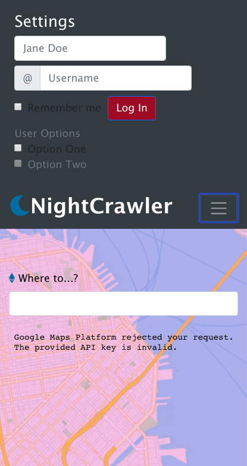

# Getting Started - NightCrawler
### 1. Why / Background
  * This is Berkeley Coding Boot Camp (BCBC) project 1 group assignment.
    * The BCBC curriculum generally focuses on JavaScript along with HTML/CSS, using the MERN (MongoDB, Express, React, Node) software stack, to teach web development skills across the client and server. 
  * The "NightCrawler" mobile web-based app came out of the need to enable users to always have viable route options that ensure safety.
    * Imagine a late night out in San Francisco with friends. After the food, drinks and festivities, how do you get home safely? Which route options do you have and how do you determine the best route?
    * Although existing technologies provide dynamic navigation, the presented data visuals don't incorporate safety data well.
    * NightCrawler's vision is an enabled user, with safety relevant data-visuals, to make the best decision in selecting from the various route options. 

### 2. What / Objectives
  * This project development, from design through deployment of the mobile web-based application, NightCrawler, used web development technologies on the client side, HTML/CSS/DOM/JavaScript, along with various libraries including Bootstrap and jQuery.
  * Data resides in a realtime database, offered by Firebase via Web API
  * Additionally, the following APIs were used to query available maps and crime databases:
    * [Google Maps Platform](https://developers.google.com/maps/documentation/):
      * Static Maps API
      * Maps JavaScript API for Heatmap capability
      * Street View API for Streetview capability
    * [DataSF](https://datasf.org/opendata/)
      * Socrata Open Data API (SODAPI) for San Francisco Data, specific to Police Department Incident Reports
  * Wireframe:
    * View 1
      * 
      * Description
    * View 2
      * 
      * Description
    * View 3
      * 
      * Description
    * View 4
      * 
      * Description
    * View 5
      * 
      * Description

### 3. How / User Stories
  * The scope of the project fit well into [Agile methodology with Scrum and Kanban frameworks](https://en.wikipedia.org/wiki/Agile_software_development). GitHub's built-in tools supported project exectution:
    * [Projects](https://github.com/jkawahara/bcbc-project1/projects/1) view leveraged as Kanban board for documenting user stories and overall progress 
    * [Issues](https://github.com/jkawahara/bcbc-project1/issues) view leveraged as Issue tracking for user stories, features and bug report
    * Project team actively participated in Srum including daily standups
  * User Stories, by categorization:
    * User Interface Design
      * Build map layer as primary view
        * Ensure mobile responsiveness, including scaling based on Apple iPhone X
      * Add secondary hub view popup onto map layer
      * Add user profile view
      * Add components to primary and secondary views
        * Contact options via buttons including 911, ride-sharing and emergency contact?
    * Configure, connect and query data, JSON structured, using APIs:
      * Integrate static map data of San Francisco, queried from Static Maps API, on map layer
      * Store Police Department Incident Reports data, queried from SODAPI, into longitude/lattitude objects
      * Integrate stored Police Department Incident Reports data, into Maps JavaScript API, to render Heatmap on map layer
        * Determine which objects (assault, theft, burglary, robbery, vehicle theft) to include in Heatmap 
    * Configure, connect and read/write data from/to Firebase Realtime database
      * Define realtime data requirements for storage of user profile in Firebase 

  * Prerequisites for Development:
    * MacBook Air (Intel Core i7, 2.2 GHz, 1 Processor, 2 Cores, 8GB)
    * Latitude E6430 (Intel Core i7, 3 GHz, 1 Processor, 2 Cores, 8GB)
    * 64 bit operating system 
    * git version 2.18.0
    * Visual Studio Code Version 1.29.1
    * [GitHub](https://github.com/jkawahara/firebase)
    * Chrome Version 70.0.3538.102 (Official Build) (64-bit)

  * Built With:
    * Custom HTML / CSS / JavaScript.
    * [Firebase](https://www.gstatic.com/firebasejs/5.5.9/firebase.js)
    * [Bootstrap](https://getbootstrap.com/docs/4.1/getting-started/introduction/)
    * [jQuery](https://cdnjs.cloudflare.com/ajax/libs/jquery/3.2.1/jquery.min.js)
    * Google Maps Platform:
      * [Static Maps API](https://developers.google.com/maps/documentation/maps-static/intro)
      * [Maps JavaScript API](https://developers.google.com/maps/documentation/javascript/tutorial) for Heatmap capability
      * [Street View API](https://developers.google.com/maps/documentation/streetview/intro) for Streetview capability
    * DataSF:
      * [Socrata Open Data API (SODAPI)](https://dev.socrata.com/foundry/data.sfgov.org/cuks-n6tp) for San Francisco Data, specific to Police Department Incident Reports

  * Installing:
    * NightCrawler is a client-side mobile web-based application, using realtime database and API services only, i.e. application doesn't require server
      * For using application, refer to Deployment section below
    * For further development, clone or download application files from [GitHub bcbc-project1](https://github.com/jkawahara/bcbc-project1), which is organized into the following directory structure:
      * /bcbc-project1
        * /assets
          * /css
            * style.css
          * /images
            * various image files
          * /js
            * config.js - private API keys file
            * js.js
        * index.html
        * LICENSE
        * README.md

  * Running the tests:
    * Unit testing & integration testing was informally executed
      * Code reviews of code changes during pull requests were tracked in [GitHub Code](https://github.com/jkawahara/bcbc-project1)
      * Peer reviews of user interface rendering and functionality completed by project team

  * Deployment:
    * Deployed on [GitHub bcbc-project1 pages](https://jkawahara.github.io/bcbc-project1/)
    * Due to API key privacy, developers and users are required to obtain their own API keys in order to further develop or use the application
      * The config.js file must be updated with respective API keys
      * TBD for using app without development, detail out config.js update; account for relative path so app works    

## Versioning
  * For the versions available, see the tags on this repository.

## Authors
  * Israel Pena Buenrostro, Swechchha Parajuli, Varvara Kourova, John Kawahara.
  * N/A- See also the list of contributors who participated in this project.

## License
  * This project is licensed under the [MIT License](LICENSE).

## Acknowledgments
  * Thanks to BCBC program personnel, especially our instructor, David Hallinan,  for their guidance on this project.
